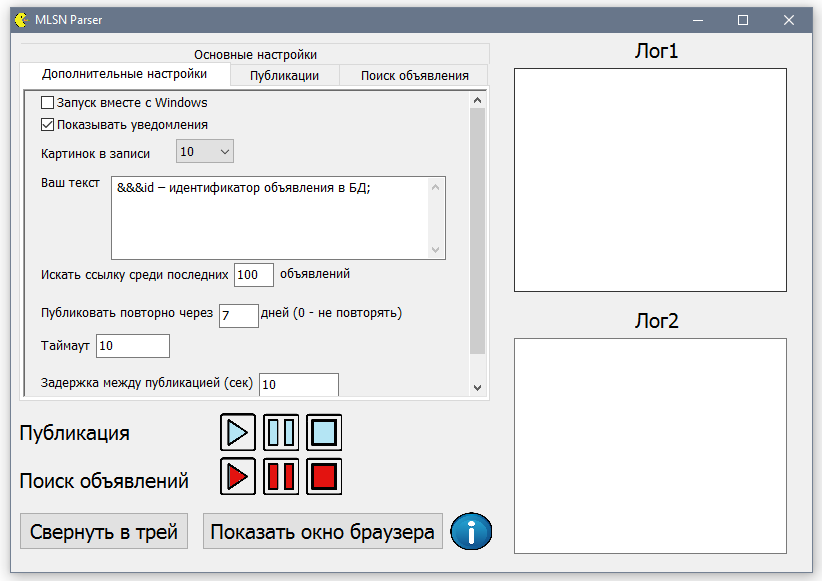
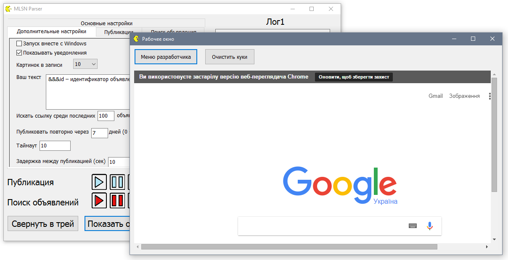

# MLSN Parser
 This project i wrote year ago on delphi. This app parse ads from mlsn.ru using Chromium and post it to vk.com by VK API. 
Now it not work and i upload it just to save here like part of my portfolio. More info about it you can read in presentation.
 
 Screenshots:

 

 
 
 Contacts:
 &nbsp;&nbsp;&nbsp;&nbsp;Vk - https://vk.com/yura_mysko
 &nbsp;&nbsp;&nbsp;&nbsp;Youtube - https://www.youtube.com/channel/UCiIj3Q0z1pNJ2KyNRcspoZw
 &nbsp;&nbsp;&nbsp;&nbsp;Habrahabr blog - https://habrahabr.ru/users/kogercoder/
 &nbsp;&nbsp;&nbsp;&nbsp;Telegram - https://t.me/yura_mysko

